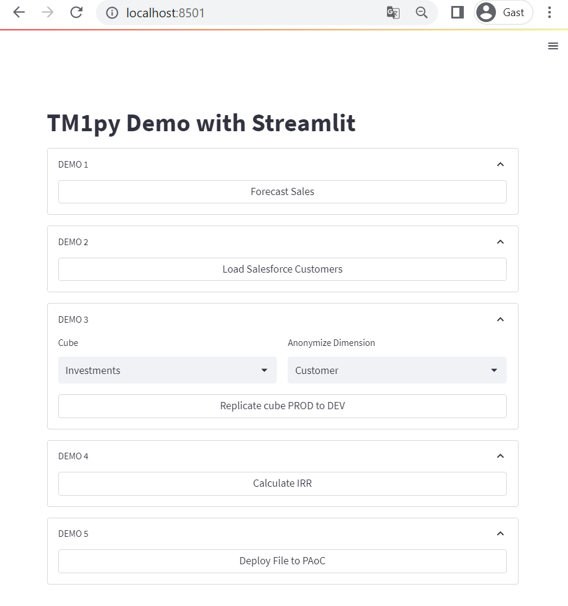

# TM1Py Demo for Cubewise Planning Analytics Conference 2023

## Setup

1. install all dependencies:
    - streamlit
    - pandas
    - tm1py
    - numpy-financial
    - statsmodels

2. Configure
    - update `prod_params` and `dev_params` in constants.py
    - use two empty TM1 instances. Or else `setup.py might` overwrite existing dimensions in TM1

3. run scripts
    - python setup.py
    - python prepare.py

## Run

`streamlit run app.py`

